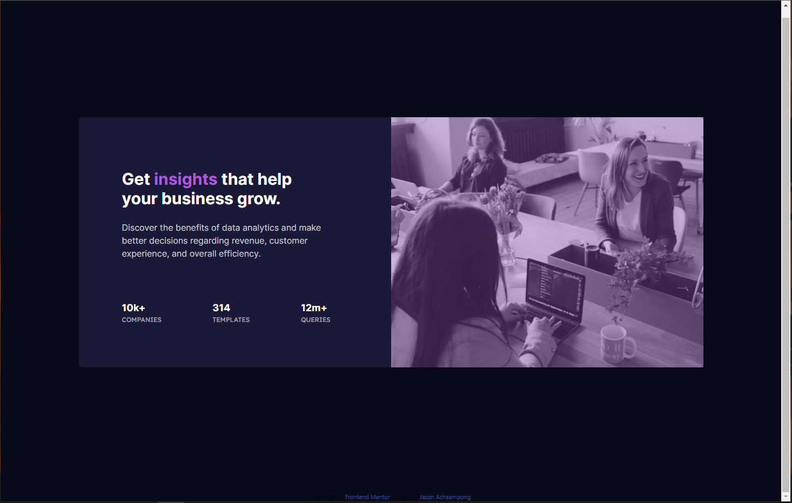

# Frontend Mentor - Stats preview card component solution

This is a solution to the [Stats preview card component challenge on Frontend Mentor](https://www.frontendmentor.io/challenges/stats-preview-card-component-8JqbgoU62). Frontend Mentor challenges help you improve your coding skills by building realistic projects. 

## Table of contents

- [Overview](#overview)
  - [The challenge](#the-challenge)
  - [Screenshot](#screenshot)
  - [Links](#links)
- [My process](#my-process)
  - [Built with](#built-with)
  - [Continued development](#continued-development)
  - [Useful resources](#useful-resources)
- [Author](#author)

## Overview

### The challenge

Users should be able to:

- View the optimal layout depending on their device's screen size

### Screenshot

### Links

- Solution URL: [Add solution URL here](https://your-solution-url.com)
- Live Site URL: [Add live site URL here](https://your-live-site-url.com)

## My process

### Built with

- Flexbox
- [Tailwind CSS](https://tailwindcss.com/) - JS library

### Continued development

I want to continue to use Tailwind CSS in more projects. I think it is a really cool framework to structure and style HTML all in one place. It also is not opinionated in terms of the design so it allows the user to create whatever they want. I will also keep in mind to use flex-grow for creating space as opposed to using padding/margin. A lot of the time, you simply want an element to take up the available space.

### Useful resources

- [Tailwind CSS Docs](https://tailwindcss.com/docs) - Needed this o 
- [Information on Flex Grow/Flex Shrink](https://medium.com/@tiffnogueira/understanding-flex-shrink-flex-grow-and-flex-basis-and-using-these-properties-to-their-full-e4b4afd2c930) - Really good article about how flex-grow works and was how I learned to implement it

## Author

- Website - [Jason Acheampong](https://www.github.com/Mascerade)
- Frontend Mentor - [@Mascerade](https://www.frontendmentor.io/profile/Mascerade)
